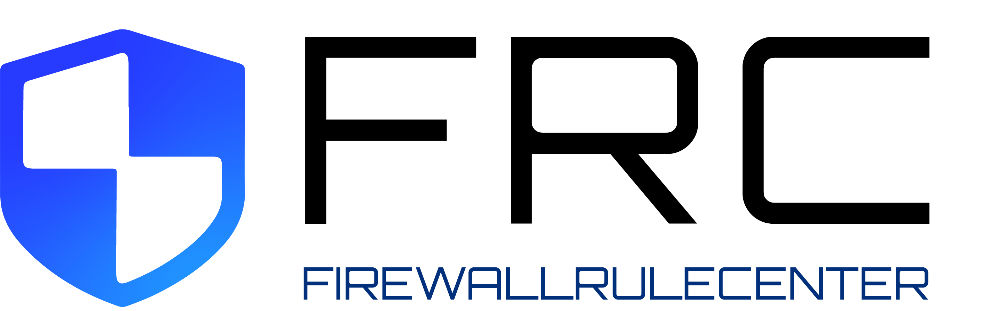

# Firewall Rule Center - Client

This project is a frontend prototype to access the [FRC Backend](https://github.com/DerFuz/firewall-rule-center).
It was written by *Jakob Wölfl* as part of his bachelors' thesis.

The project was developed and tested with React 18.2.0 and TypeScript 4.9.5

## Installing / Getting started

### Running it as a container

1. Adapt `.env`-File. Replace `REACT_APP_API_BASE_URL`-value with the URL of the API.

2. Build Container
```shell
docker build -t frc-frontend -f Dockerfile .
```

---

We also provide a rudimentary [docker-compose-File](misc/docker-compose.yaml) for running the whole application stack (backend and frontend), if both repositories are cloned. The nginx-configuration for the frontend is located [here](nginx-frc.conf). Inside there TLS configuration could be provided for example.


## Features

- The client has following features implemented:
  - ***Ruletable***
    - Tableview of all (non deleted) *Rules*
  - ***Rule*** 
    - Detailview of a single *Rule*
    - includes history of *Rule*
  - ***RuleSetRequest*** (Creation)
    - Import *Rules* from CSV for creation
    - Add/Delete/Edit *Rules* for creation
    - Add approver
  - ***RuleSetRequest***
    - Detailview of a single *RuleSetRequest*
    - includes history of *RuleSetRequest*

All other functions are currently not implemented or available for staff-members via the admin panel.

## Licensing 

This project is licensed under the **MIT license**.
See [LICENSE](LICENSE) for more information.